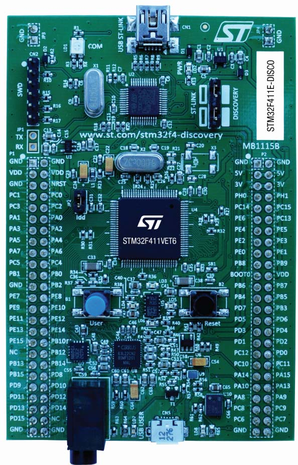

# C Sandbox

## Abstract 
Here are the programs which I have written to learn how to program for STM32F4 programmable boards. 
You can read more about this board in the User manual.
Board looks like below.

